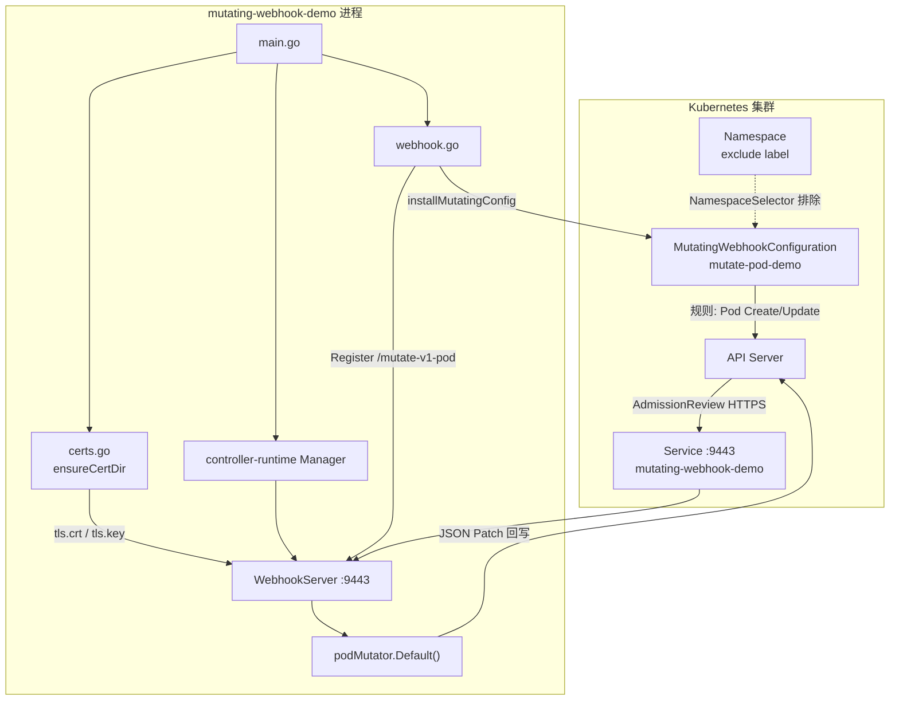
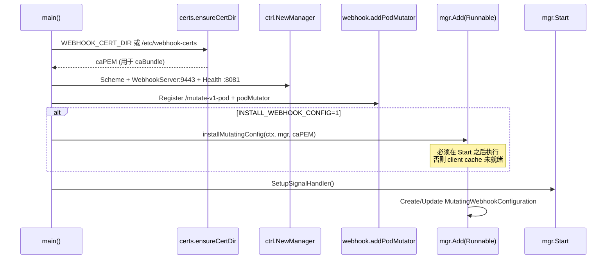
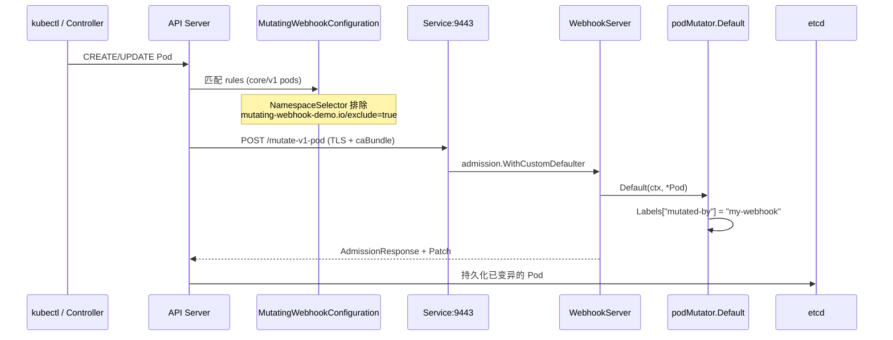
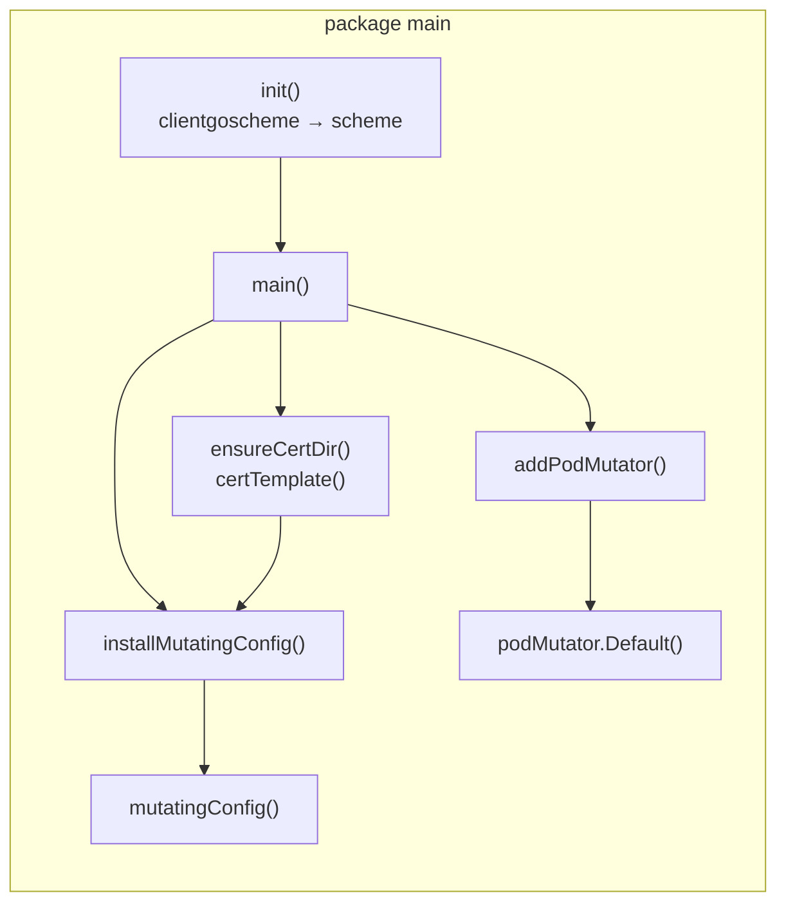
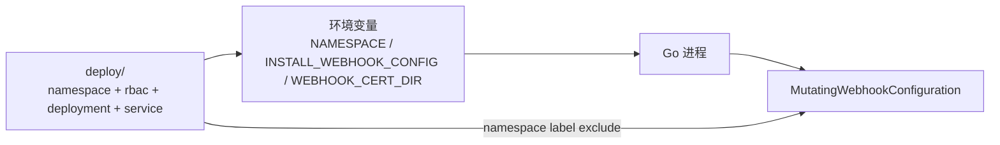

# Mutating Webhook Demo — 代码剖析与模块说明

本文用**架构图**梳理 `main.go`、`webhook.go`、`certs.go` 之间的逻辑关系，并说明 `go.mod` 中主要 Go 模块如何参与本程序。部署步骤见根目录 [README.md](../README.md)；逐文件代码解读见 [DESIGN.md](./DESIGN.md)；标准开发范式见 [STANDARD_PATTERNS.md](./STANDARD_PATTERNS.md)。

## 1. 项目总览：两段式设计

本仓库只有 **3 个 Go 源文件**（同属 `package main`），职责按「集群配置」与「进程内 Handler」拆分：

| 文件 | 职责 |
|------|------|
| `main.go` | 启动 Manager、WebhookServer、健康检查、可选安装 `MutatingWebhookConfiguration` |
| `certs.go` | 在 `CertDir` 生成/读取 TLS 证书，供 HTTPS 与 `caBundle` |
| `webhook.go` | 注册 HTTP 路径、`podMutator` 业务逻辑、集群配置模板与安装 |



**两段式理解**：

1. **集群配置**（`MutatingWebhookConfiguration`）：告诉 API Server 对哪些资源（此处为 `pods` 的 Create/Update）调哪个 Service 和路径，并设置 **caBundle** 以信任 Webhook 的 TLS。
2. **进程内 Handler**：在 WebhookServer 上 `Register(路径, webhook)`，路径与配置中的 `ClientConfig` 一致；`CustomDefaulter.Default(ctx, obj)` 中修改对象并返回。

## 2. 启动顺序（进程内逻辑）



对应 `main.go` 入口（摘录）：

```go
func main() {
    caPEM, err := ensureCertDir(certDir)
    mgr, err := ctrl.NewManager(ctrl.GetConfigOrDie(), ctrl.Options{
        Scheme: scheme,
        WebhookServer: webhook.NewServer(webhook.Options{
            Port: 9443, CertDir: certDir,
        }),
        HealthProbeBindAddress: ":8081",
    })
    addPodMutator(mgr)
    if os.Getenv("INSTALL_WEBHOOK_CONFIG") == "1" {
        mgr.Add(manager.RunnableFunc(func(ctx context.Context) error {
            return installMutatingConfig(ctx, mgr, caPEM)
        }))
    }
    mgr.Start(ctrl.SetupSignalHandler())
}
```

要点：

1. **先证书、再 Manager**：`ensureCertDir` 保证 `WebhookServer` 能起 TLS。
2. **再注册 Handler**：`addPodMutator` 把路径与 `MutatingWebhookConfiguration` 里的 `path` 对齐。
3. **配置安装延后**：`INSTALL_WEBHOOK_CONFIG=1` 时通过 `mgr.Add(Runnable)` 在 `Start` 之后写集群对象，避免 cache 未启动报错（见 `main.go` 注释）。

## 3. 准入请求路径（运行时）

用户 `kubectl apply` 一个 Pod 时：



Handler 注册与业务逻辑（`webhook.go`）：

```go
func addPodMutator(mgr manager.Manager) error {
    wh := admission.WithCustomDefaulter(scheme, &corev1.Pod{}, &podMutator{}).WithRecoverPanic(true)
    mgr.GetWebhookServer().Register(mutatePodPath, wh) // mutatePodPath = "/mutate-v1-pod"
    return nil
}

func (p *podMutator) Default(ctx context.Context, obj runtime.Object) error {
    pod := obj.(*corev1.Pod)
    if pod.Labels == nil {
        pod.Labels = make(map[string]string)
    }
    pod.Labels["mutated-by"] = "my-webhook"
    return nil
}
```

集群侧「告诉 API Server 调谁」由 `mutatingConfig()` / `installMutatingConfig()` 完成，与根目录 `mutating-webhook-config.yaml` 等价。

## 4. 源文件之间的调用关系



**常量对齐**（路径、Service、端口必须一致，否则 API Server 调不到 Handler 或 TLS 校验失败）：

| 符号 | 值 | 出现位置 |
|------|-----|----------|
| HTTP 路径 | `/mutate-v1-pod` | `webhook.go` → `mutatePodPath` |
| Service 名 | `mutating-webhook-demo` | `certs.go`、`webhook.go`、`deploy/service.yaml` |
| 端口 | `9443` | `main.go`、`mutatingConfig()`、`deploy/` |
| 变异 Label | `mutated-by=my-webhook` | `podMutator.Default` |
| 排除 Label | `mutating-webhook-demo.io/exclude=true` | `deploy/namespace.yaml`、`NamespaceSelector` |

## 5. `go.mod` 中主要 Go 模块及贡献

### 5.1 直接依赖（`require` 顶层）

| 模块 | 在本程序中的作用 |
|------|------------------|
| **`sigs.k8s.io/controller-runtime`** | 核心框架：`ctrl.NewManager` 统一生命周期；`webhook.NewServer` 提供 HTTPS 准入端点；`admission.WithCustomDefaulter` 将请求解码为 `Pod` 并调用 `Default`；`healthz.Ping` 探针；`mgr.GetClient()` 写 `MutatingWebhookConfiguration` |
| **`k8s.io/api`** | Kubernetes API 类型：`corev1.Pod`（被变异对象）、`admissionregistrationv1.MutatingWebhookConfiguration`（集群注册） |
| **`k8s.io/apimachinery`** | 运行时基础：`runtime.Scheme` 注册类型；`metav1` 元数据；`apierrors` 判断 NotFound；`utilruntime.Must` 注册 scheme |
| **`k8s.io/client-go`** | `clientgoscheme.AddToScheme` 把内置 API 类型（含 Pod）注册进 scheme，供 admission 编解码 |
| **`k8s.io/utils`** | `ptr.To()` 生成 `*int32`、`*SideEffectClass` 等指针字段，构造 `MutatingWebhookConfiguration` |

### 5.2 标准库（`certs.go`）

| 包 | 作用 |
|----|------|
| `crypto/x509`、`crypto/ecdsa`、`encoding/pem` | 自签 TLS 证书；`DNSNames` 含 `service.namespace.svc` 与 `.svc.cluster.local`，满足 API Server 调用时的主机名校验 |
| `os`、`path/filepath` | `CertDir` 读写 `tls.crt` / `tls.key` |

### 5.3 重要间接依赖（理解行为时可参考）

| 模块 | 贡献 |
|------|------|
| `github.com/go-logr/logr` + `controller-runtime/pkg/log/zap` | 结构化日志（`ctrl.SetLogger`） |
| `k8s.io/apimachinery/pkg/util/runtime` | scheme 注册失败时 panic（`Must`） |
| `gomodules.xyz/jsonpatch` / `github.com/evanphx/json-patch` | controller-runtime 将 `Default` 前后对象 diff 为 JSON Patch 返回 API Server |
| Prometheus 相关（间接） | controller-runtime Manager 可选 metrics；本 demo 未显式开启 |

## 6. 与部署清单的配合



| 组件 | 与 Go 代码的关系 |
|------|------------------|
| `deploy/namespace.yaml` | 为 Webhook namespace 打 `mutating-webhook-demo.io/exclude=true`，与 `mutatingConfig()` 中 `NamespaceSelector` 一致，避免 Webhook Pod 创建时再走准入（TLS 自举失败） |
| `deploy/deployment.yaml` | 注入 `NAMESPACE`、`INSTALL_WEBHOOK_CONFIG=1`、`WEBHOOK_CERT_DIR`；`emptyDir` 挂载证书目录 |
| `deploy/rbac.yaml` | 允许进程内 `installMutatingConfig` 创建/更新 `MutatingWebhookConfiguration` |
| `mutating-webhook-config.yaml` | 与 `mutatingConfig()` 等价的静态模板；手动 apply 时需自行填写 `caBundle` |

## 7. 层次归纳

| 层次 | 谁负责 | 做什么 |
|------|--------|--------|
| **集群配置** | `mutatingConfig` / YAML | 规定哪些 Pod 操作 → 调哪个 Service/path |
| **传输安全** | `certs.go` + `caBundle` | API Server 信任 Webhook 的 HTTPS |
| **业务变异** | `podMutator.Default` | 给 Pod 添加 label |
| **运行时骨架** | controller-runtime | Manager、WebhookServer、Admission 协议、client 写集群 |

## 8. 相关文档

| 文档 | 内容 |
|------|------|
| [DESIGN.md](./DESIGN.md) | 设计要点、逐文件代码走读、TLS/自举原理 |
| [STANDARD_PATTERNS.md](./STANDARD_PATTERNS.md) | 标准开发范式与检查清单 |
| [README.md](../README.md) | 构建、k3d 部署与验证命令 |
