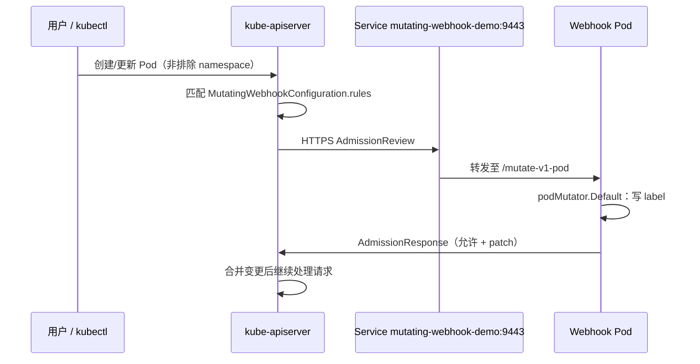

# Mutating Webhook Demo — 设计要点

本文说明本示例的**设计核心**与实现时必须抓住的**不变量**；部署步骤仍以根目录 [README.md](../README.md) 为准。**第 3 节**按文件走读代码，**第 4 节**说明 Kubernetes 准入与 TLS 等原理层背景。

若你更关心「哪些写法属于标准开发流程、如何对照生产实践」，请先读 [STANDARD_PATTERNS.md](./STANDARD_PATTERNS.md)。

若你需要**架构图、启动/准入时序图、源文件调用关系与 `go.mod` 模块说明**，见 [ARCHITECTURE.md](./ARCHITECTURE.md)。

## 1. 项目目标与边界

| 维度 | 说明 |
|------|------|
| 功能 | 对 **Pod** 的 **CREATE / UPDATE** 做一次变更：写入 label `mutated-by=my-webhook`。 |
| 非目标 | 不做 Validating、不做多资源、不做高可用副本协调、不替代 cert-manager 等生产证书方案。 |
| 对照 | 注释中与 persephone 的 `cmd/persephone-webhook`、`internal/webhook` 等流程对齐，便于迁移理解。 |

## 2. 源码结构（不含 `vendor/`）

```
mutating-webhook-demo/
├── main.go                         # 进程入口：Manager、WebhookServer、探针、Runnable 注册顺序
├── webhook.go                      # Mutating 逻辑 + MutatingWebhookConfiguration 的数据结构与安装
├── certs.go                        # CertDir 内自签 tls.crt/tls.key，SAN 对齐 Service DNS
├── mutating-webhook-config.yaml    # 与 webhook.go 中 mutatingConfig 等价的静态模板（手动 apply 需填 caBundle）
├── Makefile / Dockerfile / go.mod
└── deploy/
    ├── kustomization.yaml
    ├── namespace.yaml              # 为 Webhook 所在 namespace 打「排除」label
    ├── rbac.yaml                   # 安装/更新 MutatingWebhookConfiguration 所需集群权限
    ├── service.yaml                # 9443 → Webhook Pod
    └── deployment.yaml             # INSTALL_WEBHOOK_CONFIG、emptyDir 证书、NAMESPACE 注入
```

**职责划分**：`main` 只负责组装与生命周期；**Admission 语义**集中在 `webhook.go`；**TLS 与 SAN**集中在 `certs.go`；**集群侧网络与身份**集中在 `deploy/`。

## 3. 代码逐文件解读

### 3.1 `main.go`：进程入口与组装顺序

- **`scheme` 与 `init`**：向全局 `runtime.Scheme` 注册 Kubernetes 核心类型（含 `Pod`），供 admission 解码与序列化使用。

```21:25:/Users/I577081/Workdir/Github/mutating-webhook-demo/main.go
var scheme = runtime.NewScheme()

func init() {
	utilruntime.Must(clientgoscheme.AddToScheme(scheme))
}
```

- **证书目录**：`WEBHOOK_CERT_DIR` 未设置时用 `certs.go` 中的默认路径；**先于** Manager 创建调用 `ensureCertDir`，保证 WebhookServer 启动读盘时已有 `tls.crt` / `tls.key`，并得到 **同一份 PEM** 供后续写入 `caBundle`。

```30:38:/Users/I577081/Workdir/Github/mutating-webhook-demo/main.go
	certDir := os.Getenv("WEBHOOK_CERT_DIR")
	if certDir == "" {
		certDir = defaultCertDir
	}
	caPEM, err := ensureCertDir(certDir)
	if err != nil {
		fmt.Fprintf(os.Stderr, "ensure cert dir: %v\n", err)
		os.Exit(1)
	}
```

- **`ctrl.NewManager`**：`GetConfigOrDie()` 在 Pod 内等价于 in-cluster 配置。`WebhookServer` 绑定 **9443** 与 `CertDir`；**8081** 单独用于 **liveness/readiness**（与 admission 端口分离）。

```41:48:/Users/I577081/Workdir/Github/mutating-webhook-demo/main.go
	mgr, err := ctrl.NewManager(ctrl.GetConfigOrDie(), ctrl.Options{
		Scheme: scheme,
		WebhookServer: webhook.NewServer(webhook.Options{
			Port:    9443,
			CertDir: certDir,
		}),
		HealthProbeBindAddress: ":8081",
	})
```

- **`addPodMutator`**：在 **不依赖** client cache 的阶段完成 HTTP 路由注册（见 §4.4）。

- **`INSTALL_WEBHOOK_CONFIG` + `mgr.Add(RunnableFunc(...))`**：把「写集群里的 `MutatingWebhookConfiguration`」推迟到 Manager 已启动后的 Runnable；Runnable 内使用的 `mgr.GetClient()` 依赖的 **cache 已就绪**（见 §4.4）。

```65:74:/Users/I577081/Workdir/Github/mutating-webhook-demo/main.go
	// 将 MutatingWebhookConfiguration 的安装放到 Manager 启动后的 Runnable 中执行，
	// 否则 GetClient().Get() 会报 "the cache is not started, can not read objects"（cache 在 mgr.Start() 后才启动）
	if os.Getenv("INSTALL_WEBHOOK_CONFIG") == "1" {
		if err := mgr.Add(manager.RunnableFunc(func(ctx context.Context) error {
			return installMutatingConfig(ctx, mgr, caPEM)
		})); err != nil {
			fmt.Fprintf(os.Stderr, "add install runnable: %v\n", err)
			os.Exit(1)
		}
	}
```

- **`mgr.Start`**：阻塞主 goroutine；收到 SIGTERM/SIGINT 时 ctx 取消，各子组件优雅退出。

### 3.2 `webhook.go`：准入逻辑与集群侧配置对象

- **`addPodMutator`**：`WithCustomDefaulter(scheme, &corev1.Pod{}, &podMutator{})` 声明「请求体解码为 `Pod`」以及 **Mutating** 语义（Defaulter）；`Register` 的路径常量 **`mutatePodPath`** 必须与 `MutatingWebhookConfiguration` 中的 `path` 一致。

```31:34:/Users/I577081/Workdir/Github/mutating-webhook-demo/webhook.go
func addPodMutator(mgr manager.Manager) error {
	wh := admission.WithCustomDefaulter(scheme, &corev1.Pod{}, &podMutator{}).WithRecoverPanic(true)
	mgr.GetWebhookServer().Register(mutatePodPath, wh)
	return nil
```

- **`podMutator.Default`**：在反序列化得到的 `*corev1.Pod` 上**原地**改 `Labels`；framework 负责生成 JSON Patch 或等价响应。类型断言失败则 noop，避免 panic。

```40:49:/Users/I577081/Workdir/Github/mutating-webhook-demo/webhook.go
func (p *podMutator) Default(ctx context.Context, obj runtime.Object) error {
	pod, ok := obj.(*corev1.Pod)
	if !ok {
		return nil
	}
	if pod.Labels == nil {
		pod.Labels = make(map[string]string)
	}
	pod.Labels[labelKey] = labelValue
	return nil
}
```

- **`mutatingConfig()`**：用 Go 类型构造与 YAML 同构的集群对象：`rules` 限定 **core/v1** 的 **pods**、**Create/Update**；`ClientConfig.Service` 指向本 chart 的 Service 名与端口；`NamespaceSelector` 实现「排除带某 label 的 namespace」（与 `deploy/namespace.yaml` 配对）。

- **`installMutatingConfig`**：若资源不存在则 **Create**；存在则把 `existing.Webhooks` 整段替换为 `cfg.Webhooks` 并 **Update**（从而更新 **caBundle** 与规则副本）。这是「Pod 重启、证书变了仍能连上」的关键。

```107:122:/Users/I577081/Workdir/Github/mutating-webhook-demo/webhook.go
func installMutatingConfig(ctx context.Context, mgr manager.Manager, caPEM []byte) error {
	cfg := mutatingConfig()
	if len(caPEM) > 0 {
		cfg.Webhooks[0].ClientConfig.CABundle = caPEM
	}
	cli := mgr.GetClient()
	existing := &admissionregistrationv1.MutatingWebhookConfiguration{}
	err := cli.Get(ctx, client.ObjectKey{Name: cfg.Name}, existing)
	if err != nil {
		if apierrors.IsNotFound(err) {
			return cli.Create(ctx, cfg)
		}
		return err
	}
	existing.Webhooks = cfg.Webhooks
	return cli.Update(ctx, existing)
}
```

### 3.3 `certs.go`：自签服务证书与 SAN

- **`ensureCertDir`**：若 `tls.crt` 已存在（例如第二次启动、只读挂载场景），**直接读证书文件作为 caBundle 来源**；自签场景下「服务端证书 = 信任锚」。否则生成 ECDSA P-256 密钥对，用 **自签模板**（issuer = subject）签发叶子证书，写入 `tls.crt` / `tls.key`。

- **`certTemplate`**：`DNSNames` 列出 apiserver 作为客户端可能使用的 **SNI/Host**（短名、`*.svc`、`*.svc.cluster.local`、`localhost`）。Go 1.15+ 服务端校验主机名时以 **SAN 为主**，仅填 CN 不够。

```79:92:/Users/I577081/Workdir/Github/mutating-webhook-demo/certs.go
	// API Server 调用 Webhook 时使用 Service DNS：
	//   <service>.<namespace>.svc 或 <service>.<namespace>.svc.cluster.local
	// TLS 校验证书时只认 SAN (DNSNames)，不认 CN，因此必须把上述名字写进 DNSNames。
	svcShort := serviceName + "." + namespace + ".svc"
	svcFQDN := serviceName + "." + namespace + ".svc.cluster.local"
	return &x509.Certificate{
		SerialNumber: serial,
		Subject:      pkix.Name{CommonName: serviceName},
		NotBefore:    time.Now(),
		NotAfter:     time.Now().Add(365 * 24 * time.Hour),
		KeyUsage:     x509.KeyUsageDigitalSignature | x509.KeyUsageKeyEncipherment,
		ExtKeyUsage:  []x509.ExtKeyUsage{x509.ExtKeyUsageServerAuth},
		DNSNames:     []string{serviceName, svcShort, svcFQDN, "localhost"},
	}, nil
```

### 3.4 `deploy/` 与 `mutating-webhook-config.yaml`

- **`deployment.yaml`**：`INSTALL_WEBHOOK_CONFIG=1` 打开 Runnable 安装；`NAMESPACE` 用 downward API 注入，与 `mutatingConfig()` 里 Service 的 namespace 一致；`emptyDir` 挂载证书目录，**每次新 Pod 可重新生成证书**（与 `installMutatingConfig` 更新 `caBundle` 配套）。
- **`namespace.yaml`**：给 Webhook 所在 namespace 打 `mutating-webhook-demo.io/exclude=true`，与 `NamespaceSelector` 一致，避免自调用。
- **`mutating-webhook-config.yaml`**：与 `mutatingConfig()` 对齐的人工/GitOps 模板；**无**程序写入的 `caBundle` 时 apiserver 无法完成 TLS 校验。

---

## 4. 背后的原理

### 4.1 Kubernetes 准入链路与 Mutating Webhook

用户或控制器向 apiserver 提交资源（如创建 Pod）时，请求会经过 **admission chain**：在认证、鉴权之后、对象持久化之前，可插入 **Mutating** 与 **Validating** 准入插件。其中 **MutatingWebhookConfiguration** 描述的是「对匹配到的请求，**同步**调用集群外的 HTTPS 端点，拿到对对象的修改（patch），再由 apiserver 合并后继续后续准入与写入」。

要点：

- **同步**：默认在 apiserver 请求路径上等待 Webhook 返回（受 `timeoutSeconds` 限制），因此 Webhook 故障会直接影响资源创建延迟或失败。
- **顺序**：可注册多个 mutating webhook；各自 `mutatingwebhookconfiguration` 有顺序与匹配范围，本示例只演示**单个** webhook。
- **Mutating vs Validating**：Mutating 可以改对象默认值；Validating 只能拒绝或允许。本示例只做 mutating（`WithCustomDefaulter`）。

### 4.2 AdmissionReview / AdmissionResponse 与 JSON Patch

Apiserver 向 Webhook 发送 **`AdmissionReview`**（`api/admission/v1`），其中携带待处理对象（如 `Pod`）的 JSON、操作类型、namespace、GVK 等。Webhook 返回 **`AdmissionResponse`**：`allowed: true` 时可附带 **`patch`**（RFC 6902 JSON Patch）或（本示例中由 controller-runtime 根据你对 runtime object 的修改）生成等价 patch。Apiserver 将 patch 应用到对象上，再进入下一准入环节。

本示例不显式手写 patch，由 **controller-runtime admission** 根据 `Default` 修改后的对象与原始请求体计算差异，降低样板代码。

### 4.3 TLS：apiserver 作为客户端、caBundle 与 SAN

Webhook 的 `clientConfig` 为 **Service** 时，apiserver 通过 **Service 集群 DNS** 解析到 Endpoints，与 Pod IP 建立 **HTTPS**。此时：

- **服务端证书**：由 Webhook 进程提供（本示例为自签叶子证书 + 私钥）。
- **客户端校验**：apiserver 使用 `MutatingWebhookConfiguration` 中的 **`caBundle`**（PEM 编码的 **一个或多个** 受信 CA）验证服务端证书链；本示例自签单证书，故 **caBundle 即为该证书的 PEM**。
- **主机名校验**：客户端会校验证书 **SAN** 是否覆盖当前连接的 host（如 `mutating-webhook-demo.mutating-webhook-demo.svc`）。若 SAN 缺失，即使 `caBundle` 正确也会报「certificate is not valid for any names…」。

因此 **`certs.go` 的 DNSNames** 与 **`mutatingConfig` 的 Service.namespace/name** 必须在命名上闭环。

### 4.4 controller-runtime：Manager、WebhookServer 与 Runnable

- **Manager**：聚合 **Webhook HTTPS 服务器**、**可缓存的 API client**、**leader election（可选）**、**指标与探针** 等生命周期。`Start` 时按依赖启动各 Runnable。
- **WebhookServer**：独立监听端口，使用 `CertDir` 下标准文件名加载 TLS；你的业务只注册 `http.Handler`（此处为 admission 包装器）。
- **Runnable**：实现 `Start(ctx) error` 的组件；`mgr.Add` 注册的 Runnable 在 Manager 启动后运行。`installMutatingConfig` 使用 **`mgr.GetClient()`**（带 cache 的读路径）做 **Get/Create/Update**，故必须在 cache 已启动之后执行；若在 `main` 里 `Start` 之前直接调用，会触发 *cache is not started*。

`addPodMutator` 仅调用 `Register`，不访问 client cache，因此可在 `Start` 之前安全执行。

### 4.5 `namespaceSelector` 与「Webhook 调自己」

当 apiserver 处理 **Webhook Deployment 所在 namespace** 里新建 Pod 的请求时，若该请求仍匹配本 `MutatingWebhookConfiguration` 的 `rules`，apiserver 会再次调用同一 Webhook。新 Pod 可能尚未就绪、TLS 路由或证书与调用链交织，易出现 **死锁式** 或 **TLS 失败**。常见解法包括：

- **namespaceSelector / objectSelector**：从规则中排除 Webhook 自身 workload 所在 namespace 或带某 label 的 Pod；
- 或将 Webhook 部署到**不受该配置匹配**的独立 namespace，并保证规则不命中自己。

本示例采用 **namespace 打排除 label + NotIn 选择器**，语义清晰、改动面小。

### 4.6 `failurePolicy`、`sideEffects` 与 dry-run

- **`failurePolicy: Fail`**：Webhook 调用失败（网络、超时、500）时，**拒绝**该步准入覆盖下的资源操作，保证「未成功变更则不落库」的强语义；运维上需保证 Webhook 高可用。
- **`sideEffects: NoneOnDryRun`**：声明在 **dry-run** 请求下无副作用，满足 apiserver 对 dry-run 与安全审计的约束；若 Webhook 在 dry-run 时仍写外部系统，需选择对应的 sideEffects 类别。

---

## 5. 两段式模型（必须同时成立）

1. **集群配置（`MutatingWebhookConfiguration`）**  
   告诉 apiserver：哪些操作、哪些资源、通过哪个 **Service + path + port** 调用 Webhook，以及用 **caBundle** 校验服务端证书。

2. **进程内 HTTP(S) Handler**  
   controller-runtime 在 **WebhookServer** 上按路径注册 handler；路径必须与配置里的 `clientConfig.service.path` **完全一致**（本示例为 `/mutate-v1-pod`）。

二者缺一：要么 apiserver 不知道要调谁，要么调到了但没有路由或 TLS 失败。

## 6. 启动顺序与 `mgr.Start` 的关系

下列顺序反映在 `main.go` 中（与 §3.1、§4.4 呼应），理解它有助于排查「装不上配置」或「cache 未启动」类错误。

1. **准备证书**：`ensureCertDir` → 得到 `caPEM`（写入 `MutatingWebhookConfiguration` 的 `caBundle` 用）。
2. **构造 Manager**：`Scheme`、**9443** 上的 `WebhookServer`（`CertDir`）、**8081** 健康检查。
3. **注册 Handler**：`addPodMutator` → `Register(mutatePodPath, ...)`（不依赖 cache）。
4. **（可选）注册安装 Runnable**：仅当 `INSTALL_WEBHOOK_CONFIG=1` 时，`mgr.Add(RunnableFunc(installMutatingConfig))`。  
   **要点**：安装逻辑放在 Runnable 里，在 **`mgr.Start` 之后**与 cache 等子系统一起按 controller-runtime 约定启动，避免在 `Start` 之前用 `GetClient().Get()` 读到 *cache is not started*。
5. **`mgr.Start`**：阻塞运行 Webhook HTTPS、探针、以及已注册的 Runnable（含安装配置）。

## 7. 准入请求路径（运行时）



apiserver 作为 TLS **客户端**访问的 host 形如  
`mutating-webhook-demo.<namespace>.svc`；因此 **服务端证书的 SAN** 必须包含这些 DNS 名（见 `certs.go` 中 `certTemplate`）。

## 8. 关键设计决策

| 主题 | 做法 | 若忽略会怎样 |
|------|------|----------------|
| **避免 Webhook 调自己** | `MutatingWebhookConfiguration` 使用 `namespaceSelector`，排除带 `mutating-webhook-demo.io/exclude=true` 的 namespace；`deploy/namespace.yaml` 给本 namespace 打上该 label。 | Webhook Pod 创建/滚动升级时再次进入自身 Webhook，易出现 TLS/超时循环。 |
| **caBundle 与证书** | 自签证书与 key 落在 Pod 内 `emptyDir`；启动生成；安装逻辑把 **当前** PEM 写入 `caBundle`。 | apiserver 不信任 TLS 或 SAN 不匹配则 Pod 创建失败（`failurePolicy: Fail`）。 |
| **证书轮换与重启** | 新 Pod 重新生成证书时，`installMutatingConfig` 会 **Update** 已有 `MutatingWebhookConfiguration` 的 webhooks（含新 `caBundle`）。 | 旧 caBundle 与新区间内证书不一致，TLS 失败。 |
| **failurePolicy** | `Fail`：Webhook 不可用则拒绝受影响资源操作。 | 改为 `Ignore` 会静默跳过变更，调试用需自知。 |
| **INSTALL_WEBHOOK_CONFIG** | 由进程在集群内创建/更新集群级资源，需 **ClusterRole** 对 `mutatingwebhookconfigurations` 的 create/update 等。 | 关掉则需人工 apply 并维护 `caBundle`（见 `mutating-webhook-config.yaml`）。 |

## 9. controller-runtime 在本示例中的职责

使用 `admission.WithCustomDefaulter` + `Register` 后，框架负责：AdmissionReview 解码、`Pod` 反序列化、构造 patch/响应、HTTPS 与证书目录挂载约定等。业务侧只需实现 **`Default(ctx, obj)`** 内对 `*corev1.Pod` 的原地修改。

更直观的对比表见 [README.md](../README.md) 末尾「它帮你做了什么」一节。

## 10. 静态 YAML 与代码内对象

- **`mutating-webhook-config.yaml`**：便于审阅或与 GitOps 对齐；手动 apply 时必须填 **caBundle**。
- **`webhook.go` 中 `mutatingConfig()`**：运行时构造的同构对象，并由 `installMutatingConfig` 写入 **动态** `caBundle` 与 **当前 Pod 所在 namespace**（来自环境变量 `NAMESPACE`）。

两者规则（rules、path、port、namespaceSelector）应保持一致，否则会出现「YAML 与行为不一致」的困惑。

## 11. 扩展时建议保留的不变量

- 新增路径：同时改 **Register** 与 **`MutatingWebhookConfiguration` 的 path**。
- 改 Service 名或 namespace：同步 **证书 SAN**、**RBAC**、**mutatingConfig 中的 ServiceReference**。
- 在 Webhook 所在 namespace 内创建工作负载：要么继续用 **namespace 排除**，要么为 Webhook 使用独立、不被规则匹配的调度方式（本示例选前者，最简单）。
